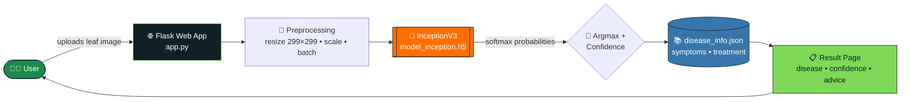
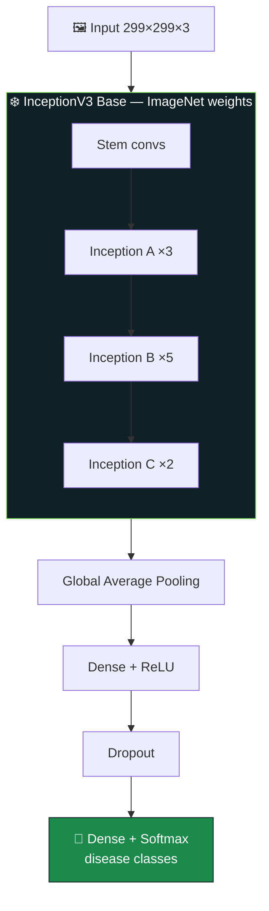
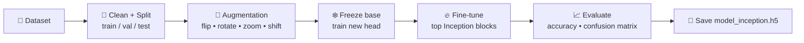

<div align="center">


<a href="https://git.io/typing-svg">
  
</a>

<br/>


[](https://leaf-disease-prediction-gt.streamlit.app/)

**🍅 An end-to-end deep learning system that looks at a plant leaf and tells you what's wrong with it — and how to fix it.**

[✨ Features](#-features) • [🏗️ Architecture](#%EF%B8%8F-system-architecture) • [🧠 Model](#-model-architecture) • [🚀 Quick Start](#-quick-start) • [☁️ Deploy](#%EF%B8%8F-deployment) • [🗺️ Roadmap](#%EF%B8%8F-roadmap)

</div>

---

## 🌟 Overview

Crop diseases quietly destroy yields, and farmers often can't get an expert diagnosis in time. **PlantAI** closes that gap: a farmer uploads a photo of a tomato, potato or pepper leaf, a fine-tuned **InceptionV3** network classifies it in seconds, and the app returns the **disease name, confidence, symptoms, and recommended treatment**.

<div align="center">

| 📸 Input | 🧠 Brain | 📋 Output |
|:---:|:---:|:---:|
| Leaf image (JPG / PNG) | InceptionV3 (transfer learning) | Disease + confidence + treatment |

</div>

---

## ✨ Features

- 🔬 **Deep-learning diagnosis**: InceptionV3 backbone pre-trained on ImageNet, fine-tuned on tomato, potato and pepper leaf images
- ⚡ **Fast inference**: single forward pass, results in about a second on CPU
- 🌿 **Actionable advice**: every prediction is mapped to symptoms and treatment via `disease_info.json`
- 🖥️ **Clean web UI**: drag-and-drop upload, instant preview, readable result card
- ☁️ **Render-ready**: `gunicorn` + `requirements.txt` for one-click cloud deploys
- 🧩 **Modular**: swap the model, the disease knowledge base, or the UI independently

---

## 🏗️ System Architecture



### 🧱 Layered View

```text
                    ┌──────────────────────────────────────────┐
   PRESENTATION     │   HTML • CSS • JS   (templates/static)   │
                    └───────────────────┬──────────────────────┘
                                        │  HTTP (multipart/form-data)
                    ┌───────────────────▼──────────────────────┐
   APPLICATION      │        Flask  •  routes  •  gunicorn      │
                    └───────────────────┬──────────────────────┘
                                        │  numpy tensor (1,299,299,3)
                    ┌───────────────────▼──────────────────────┐
   INTELLIGENCE     │   InceptionV3  →  GAP  →  Dense  →  Softmax │
                    └───────────────────┬──────────────────────┘
                                        │  class index
                    ┌───────────────────▼──────────────────────┐
   KNOWLEDGE        │        disease_info.json  (advice)        │
                    └──────────────────────────────────────────┘
```

---

## 🧠 Model Architecture



**Why InceptionV3?** Its parallel multi-scale filters (1×1, 3×3, 5×5) capture both fine lesion texture and large-scale leaf patterns, which is exactly what disease spotting needs. Transfer learning means strong accuracy without training from scratch.

### 🔁 Training Pipeline



---

## 📊 Results

The PlantAI model is built for real-time plant leaf disease classification using
InceptionV3 transfer learning.

| Metric | Result |
|---|---:|
| 🧠 Model | InceptionV3 |
| 🎯 Disease Classes | **10** |
| 🖼️ Input Image Size | **299 × 299 × 3** |
| 📦 Model Size | **~88 MB** |
| ⚡ Inference | **Single forward pass** |
| 🌿 Supported Crops | **Tomato • Potato • Pepper** |

### 🔬 Supported Disease Classes

The model can classify **10 disease/health categories**:

1. Pepper Bacterial Spot
2. Pepper Healthy
3. Potato Early Blight
4. Potato Healthy
5. Potato Late Blight
6. Tomato Mosaic Virus
7. Tomato Yellow Leaf Curl Virus
8. Tomato Bacterial Spot
9. Tomato Early Blight
10. Tomato Late Blight

### 🚀 Try PlantAI Live

**🌐 Live Demo:**
👉 https://leaf-disease-prediction-gt.streamlit.app/ and upload a leaf image. 🍅🥔🌶️

Upload a leaf image and get an AI-powered disease prediction with
confidence and treatment recommendations.

<div align="center">

---

## 🗂️ Project Structure

```text
Leaf-Disease-Prediction/
├── 📓 notebook.ipynb          # Data prep, training, evaluation
├── 🌐 app.py                  # Flask application
├── 📚 disease_info.json       # Symptoms + treatment per class
├── 🧠 model_inception.h5      # Trained InceptionV3 weights (~88 MB)
├── 📄 requirements.txt        # Pinned dependencies
├── 🎨 templates/              # HTML pages (upload, result)
├── 🖌️ static/                 # CSS, JS, sample images
├── 🖼️ assets/                 # README images & training plots
└── 📘 README.md
```

---

## 🚀 Quick Start

```bash
# 1️⃣ Clone
git clone https://github.com/itskunalkumar/Leaf-Disease-Prediction.git
cd Leaf-Disease-Prediction

# 2️⃣ Create a virtual environment
python -m venv venv
source venv/bin/activate          # Windows: venv\Scripts\activate

# 3️⃣ Install dependencies
pip install -r requirements.txt

# 4️⃣ Run the app
python app.py

---

## 🔌 How a Prediction Works

```python
img   = load_img(path, target_size=(299, 299))     # 1. resize
x     = img_to_array(img) / 255.0                  # 2. normalize
x     = np.expand_dims(x, axis=0)                  # 3. add batch dim
probs = model.predict(x)[0]                        # 4. inference
idx   = int(np.argmax(probs))                      # 5. best class
info  = disease_info[class_names[idx]]             # 6. look up advice
```

---

## ☁️ Deployment

Ready for **Render** (or any WSGI host):

```bash
gunicorn app:app --timeout 120 --workers 1 --preload
```

<details>
<summary><b>💡 Deployment tips for the free tier</b></summary>

- The ~88 MB model plus TensorFlow is heavy on a 512 MB instance. Use **1 worker** and `--preload` so the model loads once.
- Raise `--timeout` (e.g. 120) so the first cold-start request isn't killed as a `WORKER TIMEOUT`.
- Load the model **once at startup**, never inside the request handler.
- Consider converting to **TensorFlow Lite** for a much smaller memory footprint.

</details>

---

## 🛠️ Tech Stack

<div align="center">


</div>

| Layer | Technology |
|:--|:--|
| Deep learning | TensorFlow / Keras, InceptionV3 |
| Data & viz | NumPy, Pandas, Matplotlib |
| Backend | Flask, Gunicorn |
| Frontend | HTML5, CSS3, JavaScript |
| Hosting | Render |

---

## 🗺️ Roadmap

- [x] InceptionV3 transfer-learning classifier
- [x] Flask web app with treatment recommendations
- [x] Render-ready deployment
- [ ] 🔍 Grad-CAM heatmaps to show *where* the model looked
- [ ] 📱 Mobile-friendly camera capture
- [ ] 🌾 Support for more crops (apple, grape, corn…)
- [ ] ⚡ TensorFlow Lite / ONNX for faster, lighter inference
- [ ] 🌐 Multilingual advice (Hindi, Bengali, …)
- [ ] 🐳 Docker image + CI/CD

---

## 🤝 Contributing

Contributions, issues and feature requests are welcome!

1. 🍴 Fork the repo
2. 🌱 Create a branch: `git checkout -b feature/amazing-idea`
3. 💾 Commit: `git commit -m "Add amazing idea"`
4. 🚀 Push and open a Pull Request

---

## 👨‍💻 Author

<div align="center">

**Kunal Kumar**

[](https://github.com/itskunalkumar)
[](https://www.linkedin.com/in/kunalbtech2024/)

*If this project helped you, drop a ⭐ — it means a lot!*


</div>
